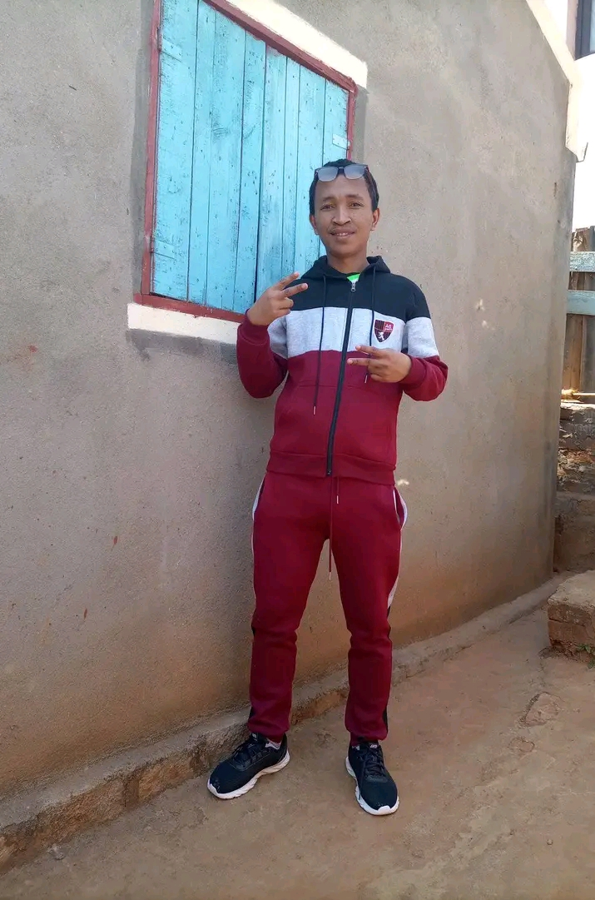

# 🎓 EDUCMAD - Plateforme Éducative Malgache



## 📚 Présentation

**EDUCMAD** est une plateforme éducative complète dédiée aux élèves et enseignants malgaches, offrant un accès facile à des ressources pédagogiques de qualité. Notre mission est de démocratiser l'éducation à Madagascar en fournissant des contenus adaptés au programme scolaire national.

## ✨ Fonctionnalités principales

- **📝 Cours structurés** par niveau (collège, lycée) et par matière
- **📋 Exercices et examens blancs** pour s'entraîner (BEPC, BAC)
- **🤖 Chatbot intelligent** pour répondre aux questions des élèves
- **🗣️ Section culturelle** avec kabary traditionnels malgaches
- **📱 Outils pratiques** (traduction, horoscope, mail temporaire)
- **🎵 Bibliothèque de chansons** (tononkira) pour la culture malgache

## 🛠️ Technologies utilisées

- **Backend**: Node.js, Express.js
- **IA**: Intégration avec Google Gemini
- **Stockage**: Système de fichiers pour les documents PDF et ressources
- **API**: Endpoints REST pour les différentes fonctionnalités

## 🚀 Installation et démarrage

```bash
# Cloner le projet
git clone https://github.com/votre-username/educmad.git

# Installer les dépendances
npm install

# Configurer les variables d'environnement
# Créer un fichier .env avec les clés API nécessaires

# Lancer le serveur
npm start
```

Le serveur démarrera sur le port 5000. Accédez à l'application via `http://localhost:5000`.

## 📂 Structure du projet

```
📁 educmad/
├── 📁 pilot/          # Modules API pour les fonctionnalités
├── 📁 public/         # Fichiers statiques et HTML
│   ├── 📁 Chatbot/    # Interface du chatbot
│   ├── 📁 cours/      # Pages des cours par niveau
│   ├── 📁 exercices/  # Exercices et examens
│   └── 📁 autres/     # Fonctionnalités supplémentaires
├── 📁 Attachement/    # Ressources et documents PDF
└── 📁 uploads/        # Uploads temporaires
```

## 🔗 Liens utiles

- [Documentation complète](https://educmad.mg/docs)
- [Contribuer au projet](https://github.com/votre-username/educmad/contributing.md)
- [Signaler un problème](https://github.com/votre-username/educmad/issues)

## 🌍 Impact social

EDUCMAD vise à réduire les inégalités d'accès à l'éducation à Madagascar en offrant:
- Des ressources accessibles même dans les zones rurales
- Un support pédagogique pour les écoles avec peu de moyens
- Une valorisation de la culture et des traditions malgaches

## 👨‍💻 Auteur

**Bruno Rakotomalala** - Développeur et fondateur du projet EDUCMAD

## 📄 Licence

Ce projet est sous licence MIT - voir le fichier [LICENSE](LICENSE) pour plus de détails.

---

*EDUCMAD - Mampianatra, Mampivoatra, Mandroso* 🇲🇬
